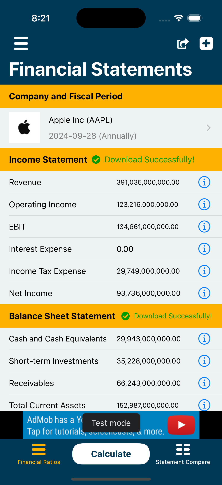
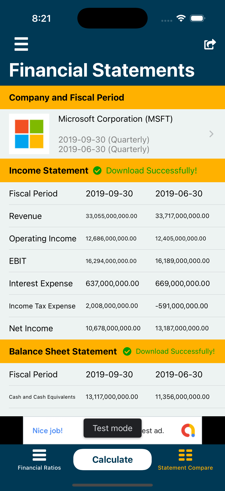
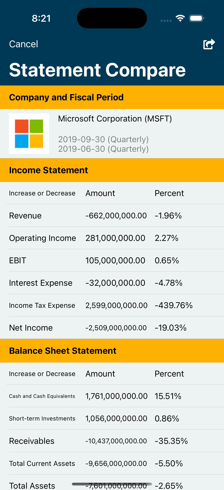

# Financial Ratios Go 📊

A comprehensive iOS application for calculating and analyzing financial ratios for companies. This app provides tools for financial analysis, company comparison, and ratio calculations with a modern, user-friendly interface.

## 📱 Screenshots

<div align="center">
  
  
  
</div>

## 📱 Features

### Core Functionality
- **Financial Ratio Calculations**: Calculate 18+ key financial ratios across 4 categories:
  - **Liquidity Measurement Ratios**: Current Ratio, Cash Ratio, Acid-Test Ratio
  - **Debt Ratios**: Debt Ratio, Interest Coverage, Cash Flow to Debt Ratio, Debt to Equity Ratio, Equity Ratio
  - **Profitability Indicator Ratios**: Operating Profit Margin, Net Profit Margin, Return on Equity, Return on Debt, Return on Invested Capital, Return on Capital Employed
  - **Cash Flow Indicator Ratios**: CFROI, Dividend Payout Ratio, Free Cash Flow-To-Sales, Retention Ratio

### Financial Statements Support
- **Income Statement**: Revenue, Operating Income, EBIT, Interest Expense, Income Tax Expense, Net Income
- **Balance Sheet**: Cash and Cash Equivalents, Short-term Investments, Receivables, Total Current Assets, Total Assets, Short-term Debt, Long-term Debt, Total Current Liabilities, Total Liabilities, Total Shareholders Equity
- **Cash Flow Statement**: Operating Cash Flow, Dividend Payments, Free Cash Flow

### Company Management
- **Company Profiles**: Create and manage company profiles with logos and information
- **Fiscal Periods**: Support for different fiscal periods (Quarterly, Annual)
- **Company Comparison**: Side-by-side comparison of financial ratios between companies
- **Pre-loaded Companies**: Extensive database of companies with financial data

### User Experience
- **Multi-language Support**: English, Japanese, Chinese (Simplified, Traditional, Hong Kong)
- **Modern UI**: Clean, intuitive interface with smooth animations
- **Offline Capability**: Core functionality works without internet connection
- **Data Persistence**: Core Data integration for local data storage

### Additional Features
- **In-App Purchases**: Remove ads functionality
- **Google Mobile Ads**: Integrated advertising system
- **App Store Integration**: Store review prompts and ratings
- **Social Sharing**: Share results and company comparisons
- **Feedback System**: Built-in feedback and support features

## 🏗️ Architecture

### Project Structure
```
Financial Ratios Go/
├── AppDelegate.swift                 # Main app delegate
├── FRGBaseModule/                    # Base UI components
├── Home/                            # Main app functionality
│   ├── Company/                     # Company management
│   ├── Controller/                  # Main view controllers
│   ├── CreateNew/                   # Creation flows
│   ├── Menu/                        # Settings and menu
│   ├── Model/                       # Data models
│   └── View/                        # Custom UI components
├── RatioResult/                     # Results display
├── Resource/                        # Static resources
├── Utilities/                       # Helper classes and extensions
└── Assets.xcassets/                 # App icons and images
```

### Key Components

#### Data Models
- `FinancialRatio.swift`: Defines all financial ratio categories and calculations
- `FinancialStatement.swift`: Income statement, balance sheet, and cash flow statement models
- `Company.swift`: Company profile and information model
- `FiscalPeriod.swift`: Fiscal period management

#### Core Features
- **Single Analysis**: Calculate ratios for individual companies
- **Comparison Mode**: Compare financial ratios between two companies
- **Company Management**: CRUD operations for company profiles
- **Data Persistence**: Core Data integration for local storage

## 🛠️ Technical Stack

### Dependencies
- **IQKeyboardManager** (~> 6.2.1): Keyboard management
- **SnapKit** (~> 5.0.0): Auto Layout DSL
- **EFCountingLabel**: Animated counting labels
- **Kingfisher**: Image loading and caching
- **SkeletonView**: Loading state animations
- **Google-Mobile-Ads-SDK**: Advertisement integration
- **MBProgressHUD**: Progress indicators
- **Then**: Object initialization
- **Toast-Swift**: Toast notifications

### Core Technologies
- **Swift**: Primary programming language
- **UIKit**: User interface framework
- **Core Data**: Local data persistence
- **StoreKit**: In-app purchases
- **Foundation**: Core functionality

### Supported Platforms
- iOS (iPhone and iPad)
- macOS (via Mac Catalyst)

## 🚀 Getting Started

### Prerequisites
- Xcode 12.0 or later
- iOS 12.0+ deployment target
- CocoaPods for dependency management

### Installation

1. **Clone the repository**
   ```bash
   git clone https://github.com/banghuazhao/financial-ratios-go.git
   cd financial-ratios-go
   ```

2. **Install dependencies**
   ```bash
   pod install
   ```

3. **Open the workspace**
   ```bash
   open "Financial Ratios Go.xcworkspace"
   ```

4. **Build and run**
   - Select your target device or simulator
   - Press `Cmd + R` to build and run

### Configuration

#### Google Mobile Ads
The app uses Google Mobile Ads for monetization. Update the following in `Info.plist`:
```xml
<key>GADApplicationIdentifier</key>
<string>YOUR_ADMOB_APP_ID</string>
```

#### App Store Connect
For production builds:
1. Update bundle identifier
2. Configure signing certificates
3. Set up App Store Connect metadata

## 📊 Usage

### Single Company Analysis
1. Select a company from the list or create a new one
2. Choose a fiscal period
3. Enter financial statement data
4. View calculated financial ratios with explanations

### Company Comparison
1. Select two companies to compare
2. Choose fiscal periods for each company
3. Enter financial data for both companies
4. View side-by-side ratio comparison

### Managing Companies
- **Add Company**: Create new company profiles with logos
- **Edit Company**: Modify existing company information
- **Fiscal Periods**: Manage different reporting periods
- **Data Import**: Import financial data from external sources

## 🌐 Localization

The app supports multiple languages:
- **English** (en)
- **Japanese** (ja)
- **Chinese Simplified** (zh-Hans)
- **Chinese Traditional** (zh-Hant)
- **Chinese Hong Kong** (zh-HK)

Localization files are located in the respective `.lproj` directories.

## 🔧 Development

### Code Style
- Follow Swift style guidelines
- Use meaningful variable and function names
- Add comments for complex business logic
- Maintain consistent indentation

### Adding New Features
1. Create new models in the `Model` directory
2. Add view controllers in appropriate directories
3. Update the tab bar controller if needed
4. Add localization strings
5. Test on multiple devices and orientations

### Testing
- Unit tests for financial calculations
- UI tests for user flows
- Integration tests for data persistence
- Performance testing for large datasets

## 📱 App Store

### Requirements
- iOS 12.0 or later
- iPhone and iPad compatible
- Universal app (iPhone + iPad)
- Mac Catalyst support

### App Store Categories
- **Primary**: Finance
- **Secondary**: Business

### Privacy
- No personal data collection
- Financial data stored locally
- Optional analytics for app improvement

## 🤝 Contributing

We welcome contributions! Please feel free to submit a Pull Request. For major changes, please open an issue first to discuss what you would like to change.

1. Fork the repository
2. Create a feature branch (`git checkout -b feature/amazing-feature`)
3. Commit your changes (`git commit -m 'Add amazing feature'`)
4. Push to the branch (`git push origin feature/amazing-feature`)
5. Open a Pull Request

### Development Guidelines
- Follow existing code patterns
- Add appropriate documentation
- Include unit tests for new features
- Update localization files
- Test on multiple devices

## 📄 License

This project is licensed under the MIT License - see the [LICENSE](LICENSE) file for details.

## 👨‍💻 Author

**Banghua Zhao**
- Created: September 2019
- Email: banghuazhao@gmail.com
- GitHub: [@banghuazhao](https://github.com/banghuazhao)

## 🙏 Acknowledgments

- Financial ratio formulas and explanations
- UI/UX design inspiration
- Community feedback and suggestions
- Open source contributors

## 📞 Support

For support and questions:
- Create an issue on GitHub
- Contact through the app's feedback feature
- Email: banghuazhao@gmail.com

## ⭐ Star History

[](https://star-history.com/#banghuazhao/financial-ratios-go&Date)

---

**Financial Ratios Go** - Making financial analysis accessible and intuitive for everyone. 📈

<div align="center">
  <sub>Built with ❤️ by <a href="https://github.com/banghuazhao">Banghua Zhao</a></sub>
</div> 